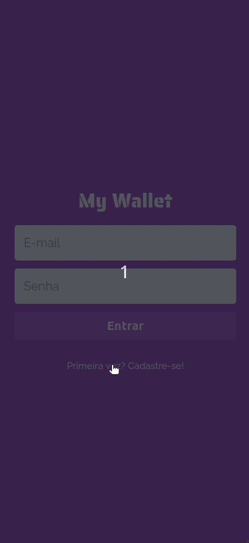

# MyWallet Frontend

This is a financial control application, where you can register your incomes and outgoings. 

## Tolling

ReactJs 
Axios 

## See the result here

This application is deployed on Versel and there it uses the backend API that is deployed on Heroku, you can visit it without having to run any application locally by going to this [url](https://mywallet-frontend-six.vercel.app/). And for a better experience, I recommend that you open in development mode and use mobile device view.

## To run locally

You must have installed node and npm and created an .env file, following the [.env.example](https://github.com/yasmimc/mywallet-frontend/blob/1885254334a5a25b35e6cfe2b501eaae04e17404/.env.example). You can use the Heroku URL that is alredy in the .env.example file or change the URL to use another backend API.

### Available Scripts

In the project directory, you can run:

#### `npm start`

Runs the app in the development mode.\
Open [http://localhost:3000](http://localhost:3000) to view it in the browser.

The page will reload if you make edits.\
You will also see any lint errors in the console.

## Backend API
You can see the backend project [here](https://github.com/yasmimc/mywallet-backend).
